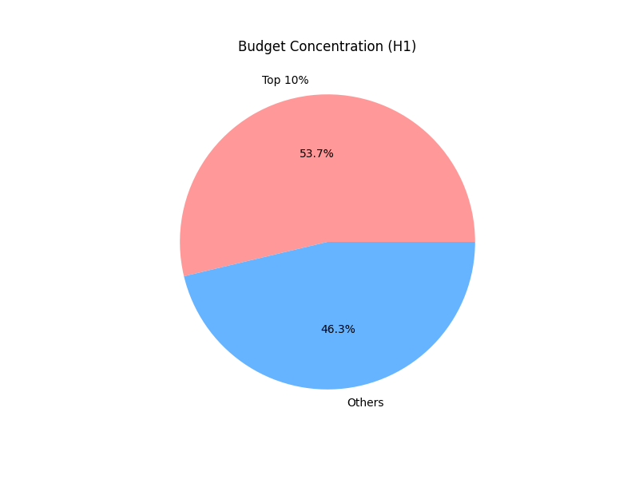
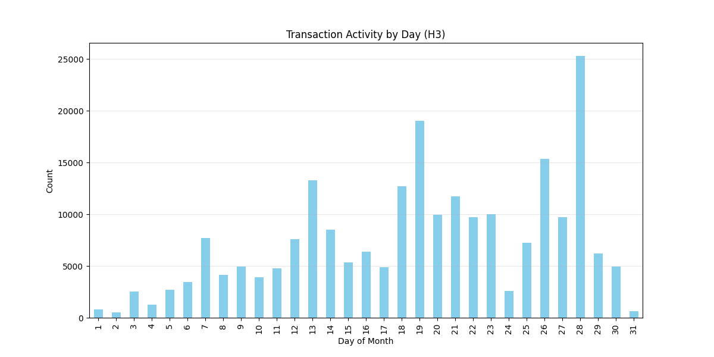

# Звіт до лабораторної роботи №1

**З дисципліни ”Середовище та компоненти розробки у моделюванні та аналізі даних”**

**Виконала:** Присліпська Софія ШІ-33


**Завдання:**

Результат роботи: проєкт що складається із наступних модулів:
- завантаження даних (data_load)

- перевірка даних (data_quality_analysis)

- дослідження даних (data_research)

- візуалізація (visualization)

**Виконання роботи:**

1. Підготовка репозиторію.

Створення репозиторію: Ініціалізовано локальний Git-репозиторій open-data-ai-analytics для контролю версій проекту.

2. Підготовка структури проекту.

Формування структури: Створено стандартну ієрархію папок (src/, data/, notebooks/, reports/figures/).

Документація: Додано базові файли (README.md) для опису проекту та навігації по папках.

3. Налаштування .gitignore.

Налаштовано .gitignore для виключення системних папок (pycache, .ipynb_checkpoints), які захаращують репозиторій.Додано виключення для віртуальних середовищ (.venv) та конфіденційних налаштувань (.env).

Обов'язково додано папку data/raw/ до списку ігнорування, щоб великі CSV-файли не завантажувалися в Git.

Створено перший коміт, який закріпив базову архітектуру проекту.

4. Заповнення README.md.

Обрано набір даних "Оплати медичним закладам за програмою медичних гарантій за 2024 рік" з порталу data.gov.ua.
( https://data.gov.ua/dataset/25a46db9-2f15-4302-9b59-9bd761c80f46 )

Мета: Проаналізувати, як держава фінансувала медичні заклади у 2024 році. Я хочу дослідити, чи є велика різниця у виплатах між різними закладами та як ці гроші розподіляються в часі.

Гіпотези для аналізу:
- Нерівномірність виплат: Більшість коштів отримує мала кількість великих установ, тоді як дрібні заклади отримують значно менші суми.
- Типи власності: Виплати приватним лікарям (ФОП) у середньому значно нижчі, ніж державним некомерційним підприємствам (КНП).
- Часова активність: Виплати відбуваються не щодня рівномірно, а мають пікові дні (наприклад, на початку або в кінці місяця).


5. Створення гілки feature/data_load

Створено окрему гілку feature/data_load. У цій гілці я написала скрипт src/load_data.py, який завантажує потрібний файл(датасет) і кладе його в папку data/raw/.

6. Змерджити feature/data_load у main.

Після перевірки, що скрипт працює і файл завантажується без помилок - я змерджила цю гілку в master.

7. Створення 2 feature-гілок.

- feature/data_quality_analysis:

я написала скрипт src/quality_analysis.py. Він перевіряє датасет на пропуски, дублікати та коректність цифр. Головною знахідкою тут стали від'ємні значення у виплатах. 

-feature/data_research:

Проведено розрахунки для перевірки гіпотез, де цифри повністю підтвердили мої припущення. Зокрема, аналіз показав, що 10% найбільших виплат концентрують понад 53% усього бюджету, а середня виплата державним закладам (КНП) у 30 разів перевищує виплати приватним лікарям (ФОП), склавши понад 3.8 мільйона гривень проти 130 тисяч. Також я дослідила часову активність і з’ясувала, що виплати мають величезну нерівномірність протягом місяця: у піковий день, 28-го числа, кількість транзакцій була у 51 раз вищою, ніж у мінімальний день.

```H1: Top 10% of payments concentrate 53.74% of total budget ```

```H2: Avg payment: FOP = 130596.28, KNP = 3859172.07```

```H3: Activity range: Min = 489 (day 2), Max = 25303 (day 28)```

```Conclusion: Activity at peak is 51.7x higher than at minimum.```

8. Після завершення розрахунків я змерджила обидві гілки в master.

9. Створення merge-конфлікт у README.md 

Для створення конфлікту я одночасно змінила одну й ту саму секцію у файлі README.md у двох різних гілках — quality та research. Коли я спробувала змерджити другу гілку в master, Git видав попередження про конфлікт, оскільки не міг автоматично вирішити, який варіант тексту залишити. Я відкрила цей файл у редакторі, де були спеціальні мітки, і вручну видалила зайве, поєднавши результати обох гілок. Після цього я зберегла виправлений файл, зробила фінальний коміт і успішно завершила злиття.

10. Створення гілки feature/visualization 

На завершальному етапі я візуалізувала отримані результати за допомогою бібліотеки matplotlib, розробивши скрипт src/visualize.py. Для першої гіпотези я побудувала кругову діаграму (h1_concentration.png), яка показує, що 10% найбільших отримувачів забирають 53.7% бюджету. Для аналізу часової активності я створила стовпчикову діаграму (h3_daily_activity.png), де чітко видно різкі піки активності, особливо наприкінці місяця 28-го числа, де кількість транзакцій перевищує 25,000. Усі графіки були збережені у папку reports/figures/.





11. Додання CHANGELOG.md і створення тегу v0.1.0.

12. git log --oneline --graph --decorate --all

Створено файл CHANGELOG.md, куди я записала ключові зміни: від налаштування структури папок до побудови графіків аналізу. Після цього я зафіксувала поточний стан коду за допомогою тегу версії v0.1.0 і запушила його на GitHub. Це дозволило чітко позначити завершену першу версію лабораторної роботи.


``` 
* 9d02eb6 (HEAD -> master, tag: v0.1.0, origin/master) added CHANGELOG for v0.1.0
* 3a9845e (origin/feature/visualization, feature/visualization) module visualization is added
*   9700c06 resolve conflict in README.md
|\  
| * 42a4a75 (origin/feature/data_research, feature/data_research) module data research is added
* | 97d7555 (origin/feature/data_quality_analysis, feature/data_quality_analysis) module check_quality is added
|/  
* 2ef0e11 modified gitignore
* 2594aa2 (feature/data_load) module load data added
* 71f328f added structure and README.md 
```  


**Висновок:**

У ході виконання роботи я опанувала цикл розробки аналітичного проєкту з використанням Git. Мені вдалося на практиці реалізувати сценарії контролю версій: роботу з паралельними гілками, розв'язання конфліктів злиття та маркування релізів тегами. Проведений аналіз реальних даних НСЗУ допог підтвердити всі висунуті гіпотези щодо нерівномірності фінансування та суттєвої різниці у виплатах між державними закладами й приватними лікарями. Результатом став структурований репозиторій з автоматизованими скриптами завантаження, перевірки та візуалізації даних, готовий до подальшого масштабування.